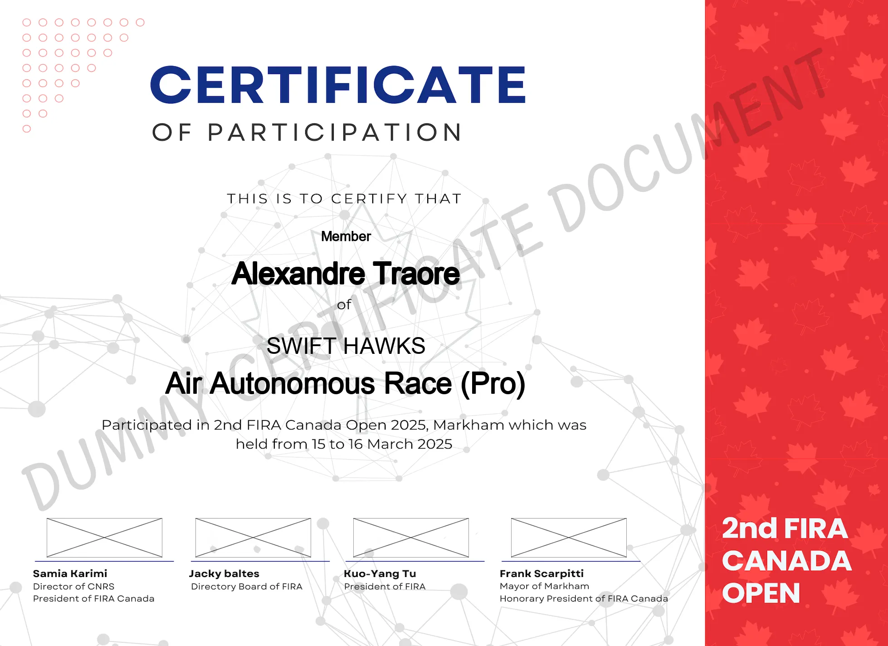
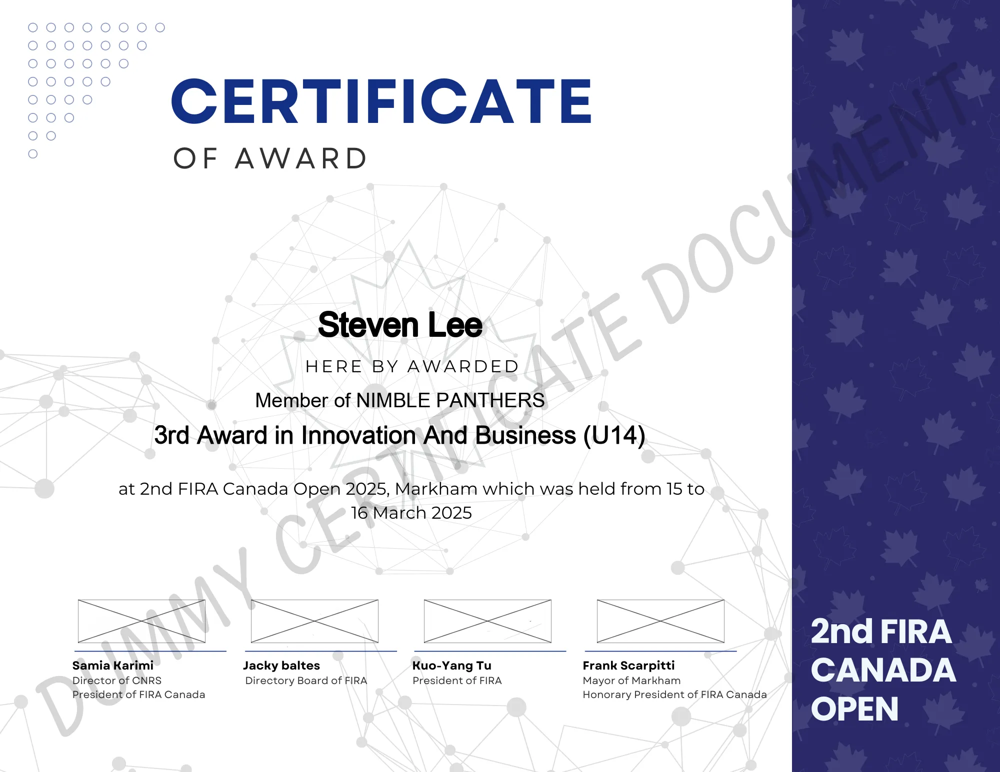

# 2<sup>nd</sup> FIRA 2025 Certificate & Badge Generator 🏅
> [!Warning] 
> The following Excel data, certificates, and generated badges are fictional and do not represent real individuals.

## Overview ✨

This project batch-generates participant certificates, award certificates, and badges from a single Excel workbook. It renders names, teams, leagues, and roles onto provided PNG templates and saves the results as `.webp` for reduced file size. It was used in practice to streamline the generation of over 600 certification and badge units.

Core scripts:

- `main.py`: Simple CLI to choose what to generate.
- `participants.py`: Generates certificates of participation.
- `awards.py`: Generates award certificates (with ordinal titles for places).
- `badges.py`: Generates badges for Members, Mentors, VIP, Org, and TC.

Key behaviors:

- Dynamic text sizing to fit within template bounds.
- DPI preserved from the template images for print-quality exports.
- Output directories are recreated on each run (previous outputs are cleared).

## Requirements ⚙️

- Python 3.8+
- System packages: ability to load a TTF font (repo includes `Arial Unicode.ttf`).
- Python packages:
  - `pandas` (Excel IO)
  - `openpyxl` (Excel engine for `.xlsx`)
  - `Pillow` (image rendering)
  - `matplotlib` (optional, for preview only)

Install dependencies:

```bash
pip install pandas openpyxl pillow matplotlib
```

## Project Structure

📁 Key folders and files

- `Base/` PNG templates:
  - `participant_base.png`, `award_base.png`
  - `team_member_fira_card.png`, `team_mentor_fira_card.png`, `tc_fira_card.png`, `org_fira_card.png`, `vip_fira_card.png`
- `dummy_list.xlsx` Excel source with required sheets.
- `Arial Unicode.ttf` font used for rendering.
- Output folders (auto-regenerated when you run generators):
  - `Participants/` → `certificate_participant_#.webp`
  - `Awards/` → `awards_certification_#.webp`
  - `Badges/` → `badge_#.webp`

## Input Data (Excel) 📊

File: `dummy_list.xlsx`

Required sheets and columns:

- Sheet `participants`: `Name`, `League`, `Team Name`, `Member Type`
- Sheet `awards`: `Name`, `League`, `Team Name`, `Member Type`, `Place`
- Sheet `badge`: `Name`, `League`, `Team Name`, `Member Type`

Notes:

- Names are title-cased; team names are upper-cased.
- In awards, numeric `Place` values are converted to ordinal titles (e.g., `1` → `1st Award`).

## Usage ▶️

Run the CLI and choose an option:

```bash
python main.py
```

Menu:

1. Generate Participant Certificates
2. Generate Awards
3. Generate Badges
4. Exit

The tool reads sheets from `dummy_list.xlsx`, uses templates from `Base/`, and writes outputs to their respective folders. Outputs are saved as `.webp` to reduce file size.

## Examples 🖼️

Participant certificate example:

_Certificate of Participation (example)_.

Award certificate example:

_Award Certificate (example)_.

Badge example:

_Badge (example)_.

## Notes & Tips 📝

- Output folders (`Participants/`, `Awards/`, `Badges/`) are deleted and recreated each time; back up files if needed.
- Ensure `Arial Unicode.ttf` remains in the project root, or update `font_path` in the scripts.
- If `pandas` cannot read the Excel file, ensure `openpyxl` is installed.

## Author 👤

Name: Arshia Naseri

 GitHub: [/arshia-naseri](https://github.com/arshia-naseri)

 LinkedIn: [/arshia-naseri](https://www.linkedin.com/in/arshia-naseri)

 Portfolio: [www.arshia-naseri.com](https://www.arshia-naseri.com)
